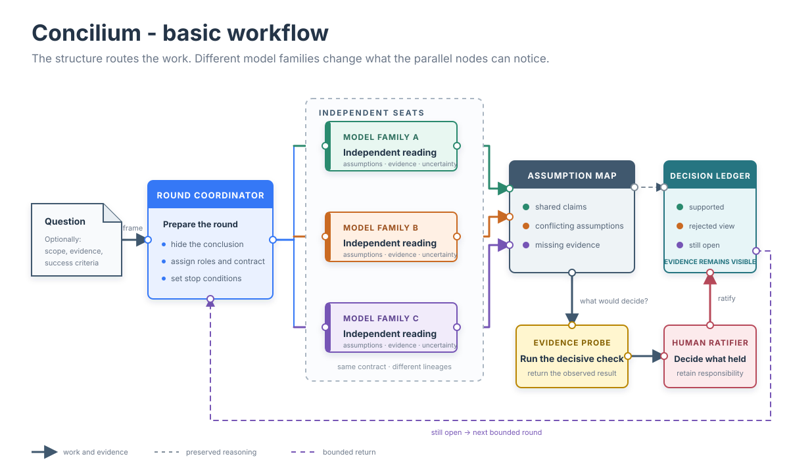

# Beyond the AI Second Opinion

*Problem-solving by combining frontier models from different providers.*

Modern agent workflows increasingly move work between models and providers - a session may begin
with one model, hand a task to another and fan out across several agents. Graph engineering rocks
by cleverly applying divide anq conquer tactics and for most task this is perfectly enough.
However, decision-making is capped by the model's own thinking capability.

For some difficult, vague or simply open-research problems with no existing solution this cap begins
to matter more than the multi-agent brute force approach. Combining the power of two and more frontier
models becomes a natural way to gain added value, and it appears when differently trained models form their
own readings of the same problem. Their disagreement may come from unique evidence interpretation,
might be optimized for different risks or quietly answer different versions of the same question.

## What happens when you do that manually?

When a reviewer sees the existing chat, it also acquires the way the first model concluded the problem. It
inherits its terminology, its selection of evidence and much of its sense of what deserves
attention. The reviewer may criticize the reasoning carefully while remaining inside boundaries
chosen by the first model. Moreover, cutting the summary does not help, data is already silently imbued
within the text.

This does not make review ineffective. It is the right tool when a concrete claim must
survive pressure. A model can be strongly critical without reconsidering the frame it was given.

*The concept*

## Let the readings form naturally

Beyond pure automation, Concilium skill intervenes one step earlier. The orchestrator does an initial
setup and review but presents the problem without revealing its own conclusion. Other models must first
decide what they think the problem is, which evidence matters and where the uncertainty lies.

“Independent” is deliberately a limited word here. AI models share parts of the public record and
many common reasoning habits. They are not independent in the statistical sense. The practical
independence comes from forming a view before seeing another model's answer. Using differently
trained model families makes it less likely that all of those first readings will simplify the
problem in exactly the same way.

## Disagreement is a core value

While voting between models is somewhat useful, disagreements is the silent outline of different thinking,
instead of burring it Concilium imposes an investigation on what produced the difference.
Is it based on an original actionable idea or the model assumed it without verifying?

The orchestrator ratifies, retries, resolves, but the strongest rejected assumption still belongs
in the result, together with the observation that rejected it.

## Conclusion

Concilium deliberately moves beyond the second opinion paradigm. The different lineage models are not there merely to approve or reject, but to give the possibility of another route into a hard-to-solve problem.

Concilium is available through the Claude Code plugin marketplace: add
`raichominev/concilium`, then install `concilium@raicho-skills`. Its source and documentation are
public in the [Concilium GitHub repository](https://github.com/raichominev/concilium).

[Previous: How Concilium Works](how-concilium-works.html)
