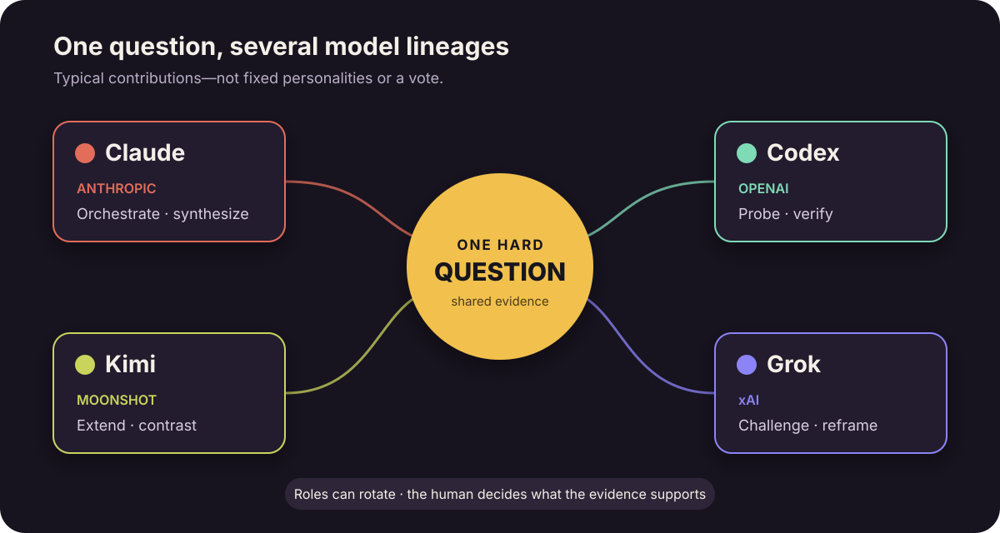
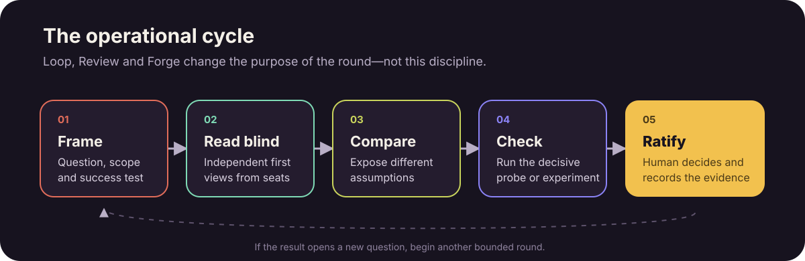

# How Concilium Works

More people are beginning to use AI models as a small team rather than as a single assistant. One
model coordinates the work; another reviews the result. A common version uses Claude as the
orchestrator and Codex as the independent reviewer.

Concilium is a general method for putting several model lineages around one difficult question.
They do not simply answer in parallel and vote. They are given different responsibilities, their
work is kept inspectable, and the human remains responsible for deciding what has actually been
established.

*Four of the eight families available, shown to illustrate the roles rather than to enumerate the
seats. The current roster and how to add one are in the repository's README.*

## Three ways to work

**Loop** begins with the problem, not the orchestrator's answer. The orchestrator presents the
question without revealing its own conclusion, so the other agents must form an independent
reading. Their findings are carried into further rounds, where agents challenge or extend one
another with new evidence. The loop ends when the result converges, the disagreement is shown to
be genuine, or no new check is available.

**Review** asks: *is this claim true?* One model makes or holds a claim, another tries to break it,
and the orchestrator checks the decisive evidence before accepting the verdict. It is useful when
an answer exists but confidence in it is not enough.

**Forge** asks: *what has nobody pointed at yet?* It begins when there is no claim to review.
Several models propose directions and build on one another's ideas through a shared register.
Nothing is voted down while it is still half formed. The aim is not consensus; it is to turn an
open question into a small number of experiments worth running.

The three modes use the same council differently. Loop protects independent judgment before the
orchestrator's view can become an anchor. Review applies pressure to a claim. Forge protects
unfinished ideas long enough for new combinations to appear.

## A simple working cycle

Each round follows the same operational discipline. Frame the question and the success test, let
the seats form independent first readings, compare the assumptions behind their disagreements,
and run the check that could decide between them. The human then ratifies what the evidence
supports and records what remains unresolved.

## Why different model families matter

Running several copies of one model can cover more ground, but those copies begin with much of the
same training, habits and sense of what a plausible answer looks like. They may explore different
branches while still passing over the same hidden assumption.

Concilium deliberately combines model families trained differently. Differences in data,
objectives, feedback and tool environments shape what each model notices, simplifies or distrusts.
This does not make the models independent in a strict sense, and it does not give each family a
fixed personality. It makes their strengths and weaknesses less likely to line up perfectly.

One model may turn a vague problem into a precise test. Another may notice that the test measures
the wrong thing. A third may preserve an awkward contextual detail that the others simplified
away. The value is not that one of them is always right. It is that their errors have different
shapes, and one model's strength can expose another's blind spot.

Concilium keeps those differences useful instead of flattening them into a vote. In Loop, the
agents form their first views without being anchored by the orchestrator. In Review, a different
lineage probes the claim from a route its author was less likely to take. In Forge, different
starting points enlarge the search space and create unexpected combinations.

The human orchestrator still has the final responsibility. Models can propose, criticize and run
checks; they cannot turn agreement into truth. The load-bearing evidence must remain visible and
reproducible.

## What Concilium is for

Concilium is not a promise that several models will manufacture truth. It is a way to organize
uncertain work so that exploration, criticism and judgment do not collapse into one fluent answer.

Use Loop when you want independent readings before revealing your own conclusion. Use Review when
you have a claim that must hold. Use Forge when the missing thing is the idea itself.

The method has already been tested on real scientific research problems. That work did not
show that models can replace research. It showed something more practical: with distinct roles,
different lineages, a shared record and experiments that can fail informatively, they can help
open a path where no ready-made path was available.

Concilium is available through the Claude Code plugin marketplace: add
`raichominev/concilium`, then install `concilium@raicho-skills`. Its source, documentation and
manual installation instructions are public in the
[Concilium GitHub repository](https://github.com/raichominev/concilium).

[Next: Beyond the AI Second Opinion](beyond-the-ai-second-opinion.html)
